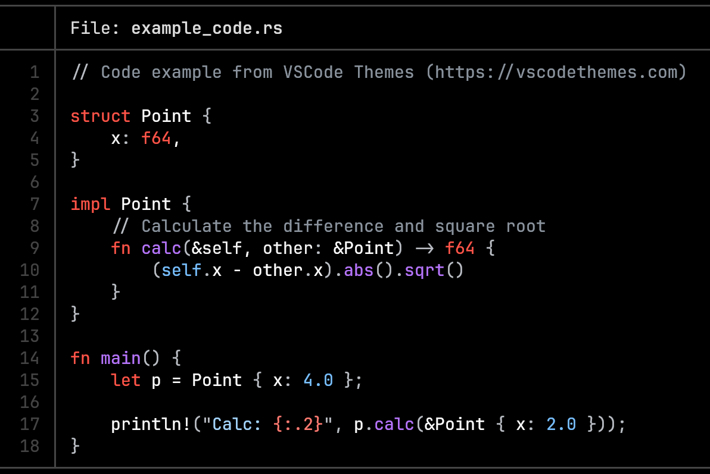

# GitHub Dark Contrast tmTheme

.tmTheme of GitHub Dark Contrast Theme ([github-dark-contrast-theme.nvim](https://github.com/Peanutt42/github-dark-contrast-theme.nvim) neovim theme)
to be used for bat and delta.

```bash
bat ./example_code.rs --theme "GitHub Dark Contrast"
```



## How to install in bat/delta

(installing as a bat theme will automatically make the theme available in delta)

```bash
mkdir -p "$(bat --config-dir)/themes"
cd "$(bat --config-dir)/themes"

# copy the ./GitHub Dark Contrast.tmTheme file into this ./themes dir
# you can also just download the single file instead of cloning this repo
cp "/path/to/this/repo/GitHub Dark Contrast.tmTheme" .

bat cache --build
```

The theme should then be available as "GitHub Dark Contrast" when running `bat --list-themes`

<br>

## Also look at:

- delta "feature"(/theme) that uses this .tmTheme: [github-dark-contrast-theme.delta](https://github.com/Peanutt42/github-dark-contrast-theme.delta)

- neovim theme "GitHub Dark Contrast" which this .tmTheme is based on: [github-dark-contrast-theme.nvim](https://github.com/Peanutt42/github-dark-contrast-theme.nvim)

- lazygit theme: [github-dark-contrast-theme.lazygit](https://github.com/Peanutt42/github-dark-contrast-theme.lazygit)

